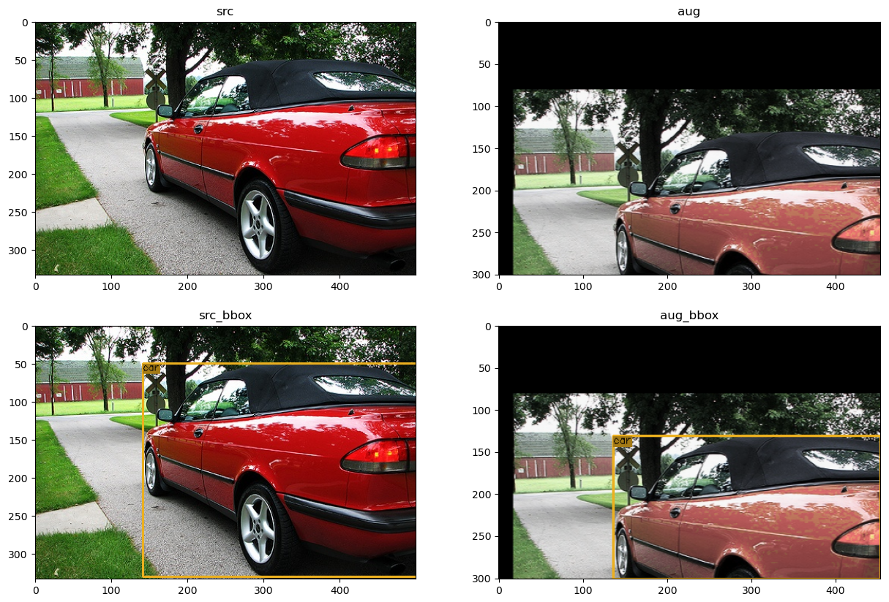
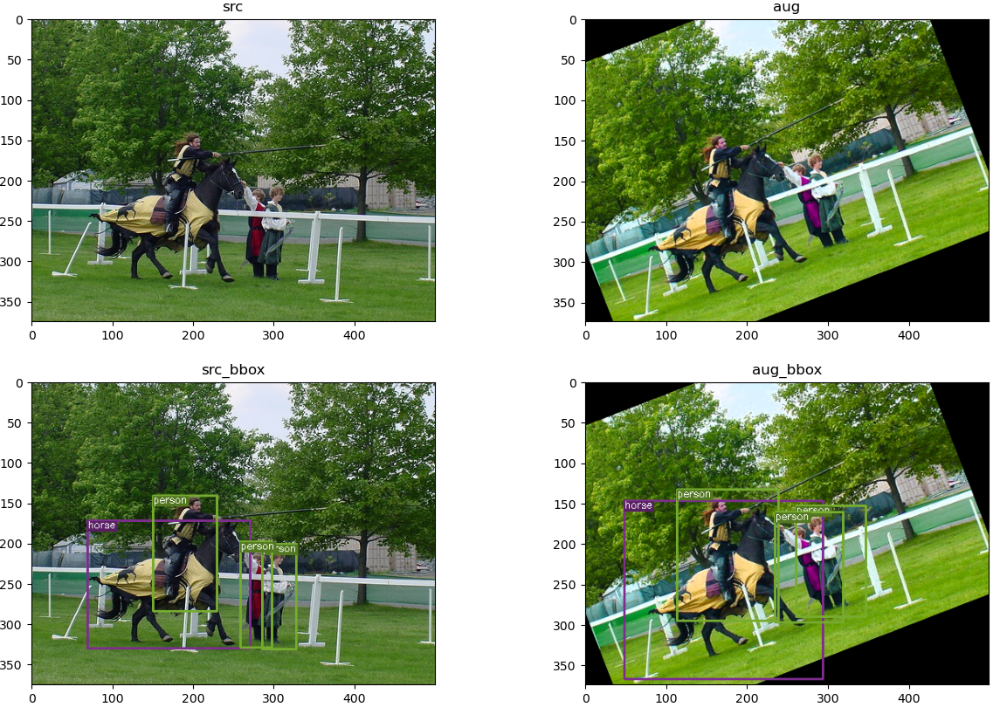

# VocAug
It is difficult to find a script which can augment VOC-format dataset, especially the bbox. Or find a script needs complex requirements so it is hard to use. Or, it is offline but not online so it needs very very large disk volume.

Here, is a simple transformer which can randomly augment VOC format dataset online! It can work with only numpy and cv2 packages!
### The highlight is, 
1) it augments both image and b-box!!!
2) it only use cv2 & numpy, means it could be used simply without any other awful packages!!!
3) it is an online transformer!!!

### It contains methods of:
1) Random HSV augmentation
2) Random Cropping augmentation
3) Random Flipping augmentation
4) Random Noise augmentation
5) Random rotation or translation augmentation

All the methods can adjust abundant arguments in the constructed function of class VocAug.voc_aug.

### Here are some visualized examples:

(click to enlarge)

e.g. #1             |e.g. #2
:-------------------------:|:-------------------------:
|

# More
This script was created when I was writing YOLOv1 object
detectin algorithm for learning and entertainment. See more
details at https://github.com/BestAnHongjun/YOLOv1-pytorch

# Quick Start
### 1. Download this repo.
```shell
git clone https://github.com/BestAnHongjun/VOC-Augmentation.git
```

or you can download the zip file directly.

### 2. Enter project directory
```shell
cd VOC-Augmentation
```

### 3. Install the requirements
```shell
pip install -r requirements.txt
```
For some machines with mixed environments, you need to use **pip3** but not **pip**.

Or you can install the requirements by hand. The default version is ok.
```shell
pip install numpy
pip install opencv-python
pip install opencv-contrib-python
pip install matplotlib
```

### 4.Create your own project directory
Create your own project directory, then copy the VocAug directory to yours. 
Or you can use this directory directly.

### 5. Create your own demo.py file
Or you can use my demo.py directly.

Thus, you should have a project directory with structure like this:
```shell
Project_Dir
  |- VocAug (dir)
  |- demo.py
```
Open your demo.py.

First, import some system packages.
```python
import os
import matplotlib.pyplot as plt
```

Second, import my VocAug module in your project directory.
```python
from VocAug.voc_aug import voc_aug
from VocAug.transform.voc2vdict import voc2vdict
from VocAug.utils.viz_bbox import viz_vdict
```

Third, Create two transformer.

```python
voc2vdict_transformer = voc2vdict()
augmentation_transformer = voc_aug()
```

For the class voc2vdict, when you call its instance with args of 
*xml_file_path* and *image_file_path*, it can read the xml file and the
image file and then convert them to VOC-format-dict, represented by **vdict**.

**What is vdict?** It is a python dict, which has a structure like:
```shell
vdict = {
    "image": numpy.array([[[....]]]),   # Cv2 image Mat. (Shape:[h, w, 3], RGB format)
    "filename": 000048,                 # filename without suffix
    "objects": [{                       # A list of dicts representing b-boxes
        "class_name": "house",
        "class_id": 2,                  # index of self.class_list
        "bbox": (x_min, y_min, x_max, y_max)
    }, {
        ...
    }]
}
```

For the class voc_aug, when you call its instance by args of vdict,
it can augment both image and bbox of the vdict, then return
a vdict augmented.

It will randomly use augmentation methods include:
1) Random HSV augmentation
2) Random Cropping augmentation
3) Random Flipping augmentation
4) Random Noise augmentation
5) Random rotation or translation augmentation

Then, let's augment the vdict.
```python
# prepare the xml-file-path and the image-file-path
filename = "000007"
file_dir = os.path.join(os.path.dirname(os.path.abspath(__file__)), "dataset")
xml_file_path = os.path.join(file_dir, "Annotations", "{}.xml".format(filename))
image_file_path = os.path.join(file_dir, "JPEGImages", "{}.jpg".format(filename))

# Firstly convert the VOC format xml&image path to VOC-dict(vdict), then augment it.
src_vdict = voc2vdict_transformer(xml_file_path, image_file_path)
image_aug_vdict = augmentation_transformer(src_vdict)
```

The 000007.jpg and 000007.xml is in the dataset directory under Annotations and JPEGImages separately.

Then you can visualize the vdict. I have prepare a tool for you. That is
**viz_vdict** function in **VocAug.utils.viz_bbox** module.
It will return you a cv2 image when you input a vdict into it.

You can use it like:
```python
image_src = src_vdict.get("image")
image_src_with_bbox = viz_vdict(src_vdict)

image_aug = image_aug_vdict.get("image")
image_aug_with_bbox = viz_vdict(image_aug_vdict)
```

Visualize them by matplotlib.
```python
plt.figure(figsize=(15, 10))
plt.subplot(2, 2, 1)
plt.title("src")
plt.imshow(image_src)
plt.subplot(2, 2, 3)
plt.title("src_bbox")
plt.imshow(image_src_with_bbox)
plt.subplot(2, 2, 2)
plt.title("aug")
plt.imshow(image_aug)
plt.subplot(2, 2, 4)
plt.title("aug_bbox")
plt.imshow(image_aug_with_bbox)
plt.show()
```

Then you will get a random result like this.


For more detail see demo.py .

# Detail of Algorithm
I am writing this part...